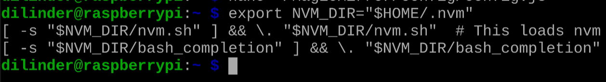
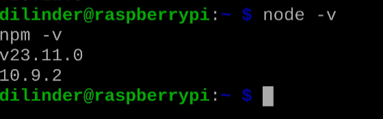
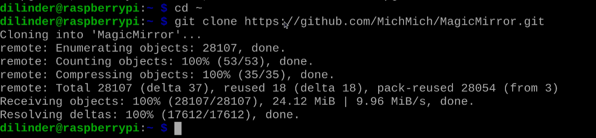
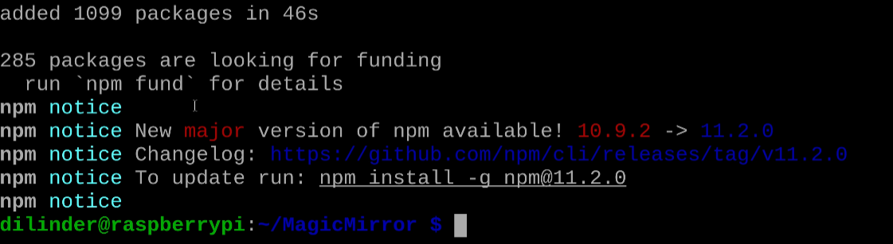

# Installation Guide

!!! danger "Loss of Progress"
      An interrupt of power could cause the corruption of your SD card resulting a loss of progress. 

## Overview

This section guides you through installing the MagicMirror² software on your Raspberry Pi. MagicMirror² is an open-source platform that transforms your mirror into a customizable display with various modules for different types of information.

## Preparing Your Raspberry Pi

### Update Your System

Before installing any new software, ensure your system is up to date:

1. **Open** a terminal window
2. **Run** the following commands: 
   ```
   sudo apt update
   sudo apt upgrade -y

   ```
3. **Wait** for the process to complete (may take several minutes)

    !!! note "System Updates"
         Keeping your system updated ensures compatibility with the latest software and improves security.

### Install Required Dependencies

MagicMirror² requires several dependencies to function properly:

1. **Install** Node Version Manager through the terminal window: (NVM)
   ```
   sudo apt install -y curl build-essential libssl-dev
   curl -o- https://raw.githubusercontent.com/nvm-sh/nvm/v0.39.5/install.sh | bash
   ```

2. **Reload** Reload your profile to start using Node Version Manager: (NVM)
   ```
   export NVM_DIR="$HOME/.nvm"
   [ -s "$NVM_DIR/nvm.sh" ] && \. "$NVM_DIR/nvm.sh"  # This loads nvm
   [ -s "$NVM_DIR/bash_completion" ] && \. "$NVM_DIR/bash_completion"
   ```

    
3. **Install** Install Node.js v20 
   ```
   nvm install node
   ```

4. **Verify** the installation:
   ```
   node -v
   npm -v
   ```

    

    !!! note "Version Specification"
         Version may need to be specified.


5. **Install** other required packages:
   ```
   sudo apt install -y git python3-pip
   ```

## Installing MagicMirror²

### Clone the Repository

1. **Navigate** to your home directory:
   ```
   cd ~
   ```
   
2. **Clone** the MagicMirror repository:
   ```
   git clone https://github.com/MichMich/MagicMirror.git
   ```
   

3. **Navigate** to the MagicMirror directory:
   ```
   cd MagicMirror
   ```

### Install Dependencies and Run Setup

1. **Install** the required npm packages:
   ```
   npm install
   ```

    

    !!! warning "Installation Time"
         This process may take 10-15 minutes on a Raspberry Pi. Be patient and don't interrupt the process.

2. **Copy** the sample configuration:
   ```
   cp config/config.js.sample config/config.js
   ```
     
3. **Test** the installation:
   ```
   npm start
   ```
If successful, you should see the MagicMirror interface appear on screen.
    * **Press** `Ctrl+Q` to exit the application

   

!!! success "Completion of installing MagicMirror²"
      You've done it! Congratulations!

## Conclusion

You have now successfully installed MagicMirror² on your Raspberry Pi and configured it to start automatically at boot. In the next section, we'll configure the basic modules and customize the display layout.